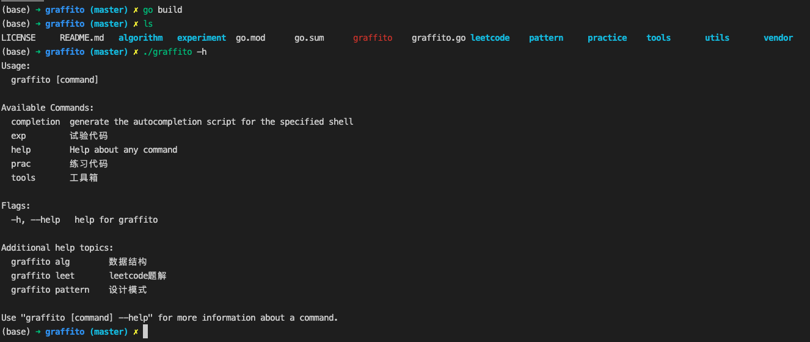
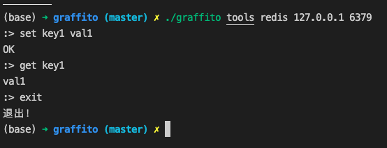
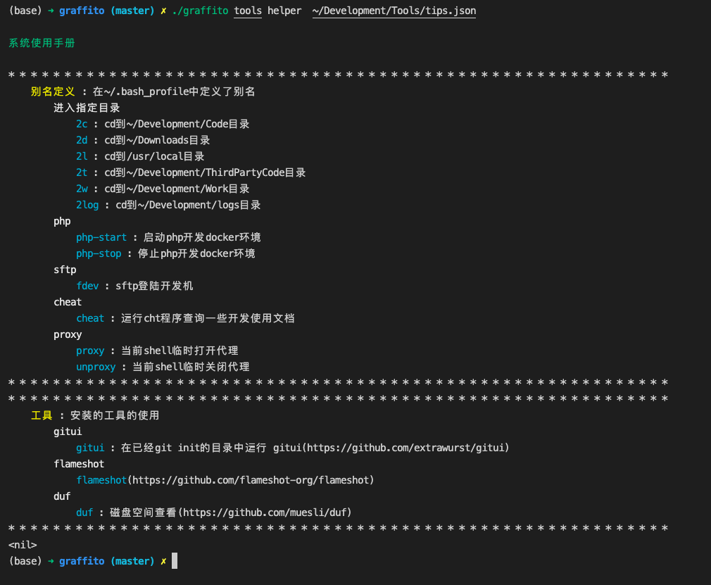
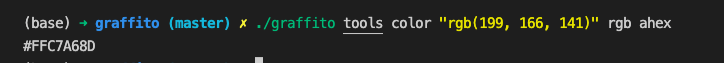

# Golang代码涂鸦
## 一. 用法
  1. 编译构建
        - 克隆代码 ```git clone git@github.com:2lovecode/graffito.git```
        - 进入项目目录 ```cd graffito```
        - 构建 ```go build```
  2. 使用各个功能
        - 查看命令帮助 ```./graffito -h```
        - 执行命令，例如 ```./graffito tools count abc``` 计算字符串abc的字符数
  
    
## 二. 目录说明

| 目录  | 说明  | 备注                       |
| :---:  | :------:  | :------------------------  |
| tools | 百宝工具箱     |用go实现的命令行工具集|
| algorithm |   数据结构&算法  |数据结构和算法代码实现|
| experiment |  试验性实现     |平时一些灵光一现的想法，会在这里体现|
| pattern |  设计模式     |设计模式的golang实现|
| practice | 练习代码     |golang编程常见问题，语言特性，特殊用法，会在这里体现|

## 三. 模块说明

### 百宝工具箱
#### [计算字符串字符个数](tools/string_op)
 - 命令：```./graffito tools count abc```
#### [简易redis命令行客户端](tools/redis)
 - 命令：```./graffito tools redis 127.0.0.1 6379```
 - 
 - 目前支持的命令: ``` set get hset hget hgetall```
#### [自定义命令帮助工具](tools/helper)
 - 命令：``` ./graffito tools helper  ~/Development/Tools/tips.json  ```
 - tips.json文件 可以参考[tips.json](tools/helper/tips.json)
 - 
#### [颜色格式转换工具](tools/color)
 - ``` ./graffito tools color "rgb(199, 166, 141)" rgb ahex ```
 - 


### 数据结构&算法

#### [数组实现](algorithm/link/array.go)
 - 命令：```./graffito alg link array```

#### [哈希表-开放寻址](algorithm/hashmap/hash.go)
 - 命令：```./graffito alg hashmap open-addressing```

#### [哈希表-分离链表](algorithm/hashmap/hash.go)
- 命令：```./graffito alg hashmap separate-chaining```

#### [哈希表-分离链表重哈希](algorithm/hashmap/hash.go)
- 命令：```./graffito alg hashmap separate-chaining-rehash```

#### [最大堆](algorithm/tree/heap.go)
 - 命令：```./graffito alg tree max-heap```

#### [快排](algorithm/sort/quick.go)
 - 命令：```./graffito alg sort quick```

#### [斐波那契数列](algorithm/other/fibonacci.go)
- 命令：```./graffito alg other fibonacci```

### 实验代码
#### [事件绑定与触发](experiment/event)
 - 命令：``` ./graffito exp event ```

#### [有依赖关系的并行模型](experiment/depends)
 - 详情见 https://github.com/2lovecode/depends
 - 命令：``` ./graffito exp depends ```
#### [一种批量多样数据的处理模式](experiment/mode0)
 - 命令：``` ./graffito exp mode0 ```

### LeetCode
| 功能  | 说明  | 备注                       |
| :---:  | :------: | :------------------------:  |
| [LeetCode](algorithm/leetcode) |  |  |

### 设计模式
| 功能  | 说明  | 备注                       |
| :---:  | :------: | :------------------------:  |
| [建造者](pattern/builder.go) |  |  |
| [工厂模式](pattern/factory.go) |  |  |
| [对象池模式](pattern/obj_pool.go) |  |  |
| [观察者模式](pattern/observer.go) |  |  |
| [单例](pattern/singleton.go) |  |  |
| [策略模式](pattern/strategy.go) |  |  |

### 练习代码
| 功能  | 说明  | 备注                       |
| :---:  | :------: | :------------------------:  |
| [数组](practice/array/main.go)|  |  |
| [通道](practice/channel/main.go)|  |  |
| [文件读写](practice/file/main.go)|  |  |
| [函数](practice/func/main.go)|  |  |
| [gin框架使用demo](practice/gin/main.go)|  |  |
| [http实现demo](practice/http/main.go)|  |  |
| [接口](practice/interface/main.go)|  |  |
| [json](practice/json/main.go)|  |  |
| [切片](practice/list/main.go)|  |  |
| [map](practice/map/main.go)|  |  |
| [协程](practice/routine/main.go)|  |  |
| [字符串](practice/string/main.go)|  |  |
| [结构体](practice/struct/main.go)|  |  |
| [异步简单实现](practice/sync/main.go)|  |  |
| [time包](practice/time/main.go)|  |  |
| [zookeeper连接demo](practice/zookeeper/main.go)|  |  |