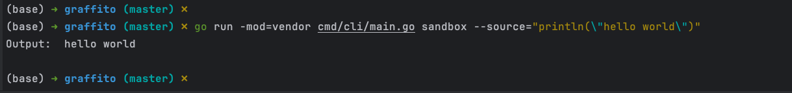

## 工具集&代码片段

Golang代码集。包含一些小工具的实现，试验性质的代码片段等。

## 目录结构
- `cmd` 命令行工具
- `docs` 文档
- `internal` 内部代码
- `pkg` 公共代码
- `test` 测试代码
- `third_party` 第三方依赖
- `tools` 工具 - 逐渐迁移到`cmd`目录
- `web` 前端代码

## 构建
- `make all` 同时构建web和cli
- `make web` 构建web
- `make cli` 构建cli命令行工具

## 开发环境启动
-  需要在根目录先执行 `go mod vendor`
-  `make run-web` 启动web服务
-  `make run-cli` 执行cli命令

## 简介
### WEB端
#### Go运行沙盒

### CLI命令行工具
#### Go运行沙盒
